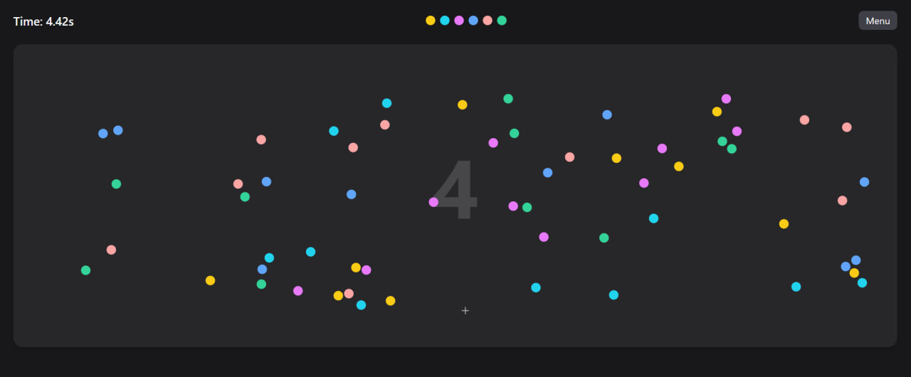

# 🎨 Sorting Game

An interactive color-sorting game built with **React**, **TypeScript**, **Redux Toolkit**, and **Vite**.
Your goal is simple — drag and group colorful dots by color as fast as you can!



---

## 🚀 Features

- ⚡️ Smooth real-time physics simulation
- 🧠 Smart “win detection” algorithm based on clusters
- 🎨 Customizable colors and dot counts
- 📱 Works on desktop and mobile (touch & mouse support)
- 💾 Deterministic random generation via seed
- 🛠️ Adjustable movement speed and intensity

---

## 🕹️ How to Play

1. Choose:
   - Number of colors
   - Dots per color
   - Movement intensity
2. Press **Play**
3. Use your **cursor** (or **finger on mobile**) to move and separate dots into color groups.
4. When each color forms a compact cluster — you win!

---

## 💻 Tech Stack

- **React 18**
- **TypeScript**
- **Redux Toolkit**
- **Vite**
- **TailwindCSS**

---

## 🧩 Local Setup

Clone the repository and start locally:

```bash
# Clone
git clone https://github.com/NovokhatskyiVitalii/sorting-game.git
cd sorting-game

# Install dependencies
npm install

# Run in development mode
npm run dev

# Build for production
npm run build
```

## 🧩 Folder Structure

```bash
src/
├── app/            # Redux store & app-level setup
│   └── store.ts
├── components/     # UI and game elements
├── hooks/          # Custom hooks
├── slices/         # Redux slices (state)
├── utils/          # Game logic & helpers
├── index.css       # Tailwind styles
└── main.tsx        # App entry point
```

## 🧠 Key Files

| File                 | Purpose                                           |
| -------------------- | ------------------------------------------------- |
| **gameGen.ts**       | Generates dot positions and checks win conditions |
| **GameCanvas.tsx**   | Handles physics, drawing, and animation           |
| **Menu.tsx**         | Game settings and controls                        |
| **seedGenerator.ts** | Generates deterministic random seeds              |

## 🌐 Demo

🎮 **Live Demo:** [Play the Game](https://novokhatskyivitalii.github.io/sorting-game/)

## 🪄 Author

Vitalii Novokhatskyi
Frontend Developer | React / TypeScript / Redux
